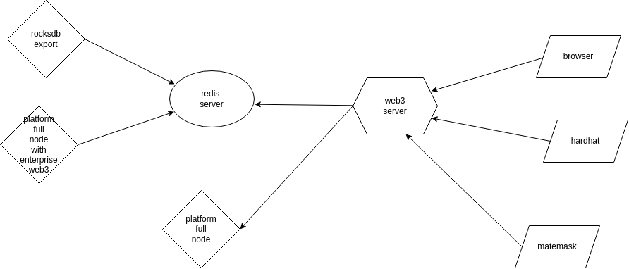

# enterprise-web3 部署

## 1.redis
- 准备redis服务（单例或集群）运行以下命令导入lua脚本
    ```
    cd enterprise-web3/
    cat redis-versioned-kv/lua/versioned-kv.lua | redis-cli -h 127.0.0.1 -p 6379 -x FUNCTION LOAD REPLACE
    ```

## 2.compile executable program
- 编译rocksdb-exporter和web3-service可执行程序
    ```
    docker build -t enterprise-web3 -f Dockerfile .
    ```

## 3.deploy && run

- 修改rocksdb-exporter的配置文件，修改redis路径以及历史数据的下载地址（LATEST_URL）
    ```
    vim rocksdb-exporter/Dockerfile
    ```
    
- 运行rocksdb-exporter，向redis中导入数据，如果中间运行失败，则重新运行
    ```
    docker build -t rocksdb-exporter -f rocksdb-exporter/Dockerfile
    docker run -it --rm rocksdb-exporter
    ```

- 运行platform full node with enterprise web3（需要加载rocksdb-exporter中下载的数据，并且不需要对外提供接口）
    ```
    cd platform
    docker build -t platform-enterprise-web3 -f container/Dockerfile-enterprise-web3 .
	docker run -itd --name platform-web3 platform-enterprise-web3
    ```
- 运行platform full node（只需要对外提供26657接口，供web3-service发送交易）

- 修改web3-service的配置文件，修改redis_url、tendermint_url（修改为上一步部署的full node地址）、chain_id、gas_price
    ```
    vim rocksdb-exporter/Dockerfile
    ```

- 运行web3-service
    ```
    docker build -t web3-service -f web3-service/Dockerfile
    docker run -itd --name enterprise-web3-service web3-service
    ```
